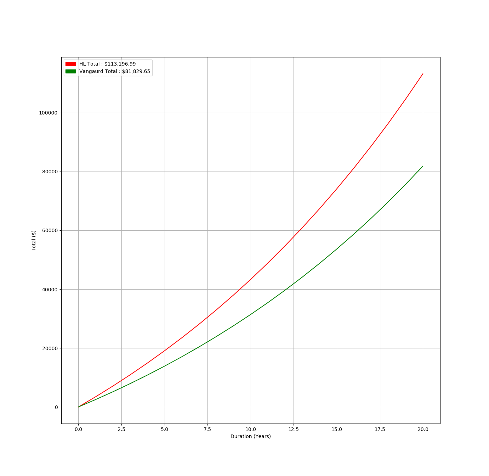

# Investment Charges Comparison
[](https://gitlab.com/DeveloperC/investment-charges-comparison/-/pipelines)
[](https://conventionalcommits.org)
[](https://www.gnu.org/licenses/agpl-3.0)


Whilst trying to compare investment options and platforms against their various attributes, I needed the capability to calculate and graph the data to help me evaluate my choices and make the best decision.

I was not able to find a program which could achieve this, so I created my own Python script to calculate and plot the data. The script has the capability to parse a CSV file plotting data such as monthly contributions, expected growth, platform charges, etc. Any number of investment options can be entered by the CSV file and visual options such as line colour and title can be declared as well to help data comparison.


## Installing Dependencies
via Arch Linux's package manager.

```
pacman -S python-matplotlib
```

via pip and a virtual environment.

```
virtualenv -p python3 .venv
source .venv/bin/activate
pip install -r requirements.txt
```


## Usage
The Python script reads in the values from a CSV file. This allows you to graph as many investments as you desire. You can define the input CSV file via the argument `--input`.

e.g.

```
python3 investment-charges-comparison.py --input data.csv
```


## CSV Format
```
Format : Name, Colour, Monthly Contribution (£), Duration (Years), Growth (%), Platform Fee(%), Platform Yearly Cap(£), Fund Fee (%)
```

e.g.

```
HL, red, 200, 20, 5, 0, 0, 0.1
Vangaurd, green, 200, 20, 5, 0, 0, 0.15

```


## Generated Graph Example

